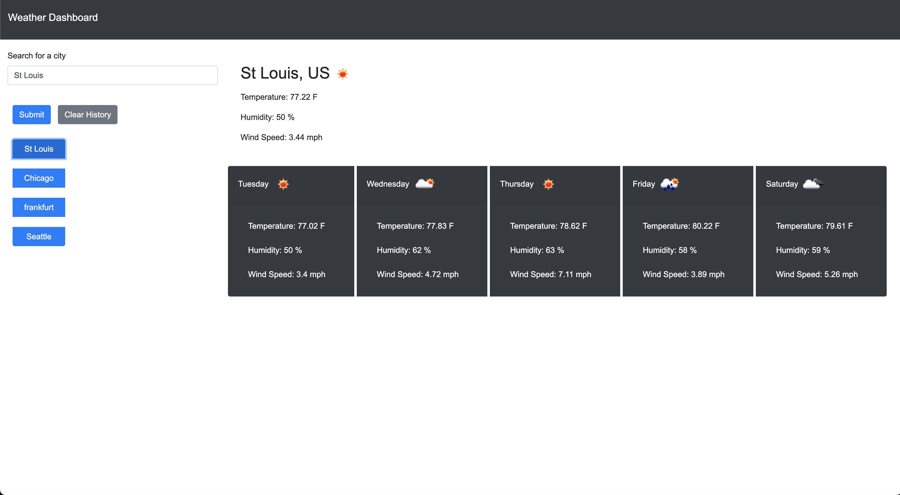

# Weather-Dashboard


## Acceptance Criteria

```
GIVEN a weather dashboard with form inputs
WHEN I search for a city
THEN I am presented with current and future conditions for that city and that city is added to the search history
WHEN I view current weather conditions for that city
THEN I am presented with the city name, the date, an icon representation of weather conditions, the temperature, the humidity, and the wind speed
WHEN I view future weather conditions for that city
THEN I am presented with a 5-day forecast that displays the date, an icon representation of weather conditions, the temperature, the wind speed, and the humidity
WHEN I click on a city in the search history
THEN I am again presented with current and future conditions for that city
```

## TO DO 
1. move the search bar and city select to the left side of the page
2. add a button to clear the search history?
3. move all of the weather data to the right side of the page
4. show weather icons for the current weather and the 5 day forecast
6. hide the weather until a city is selected


## Screenshot



## Live Application
https://drewjordan414.github.io/Weather-Dashboard/